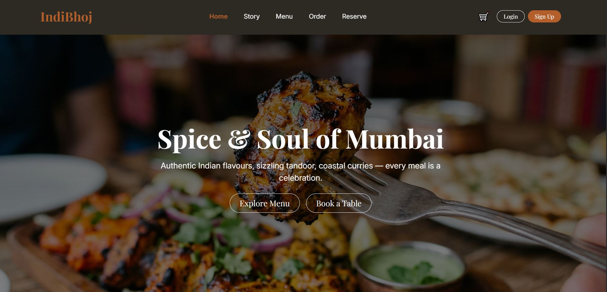
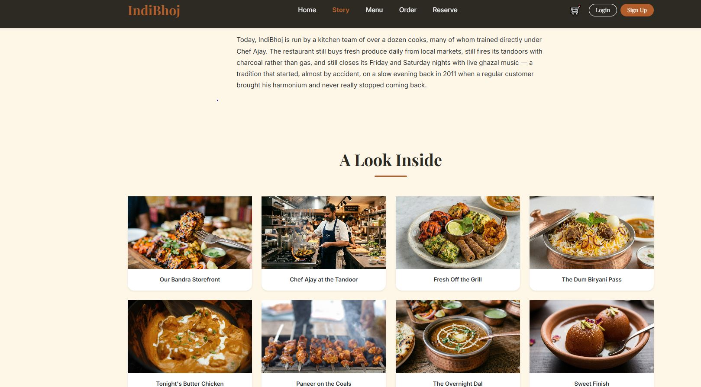
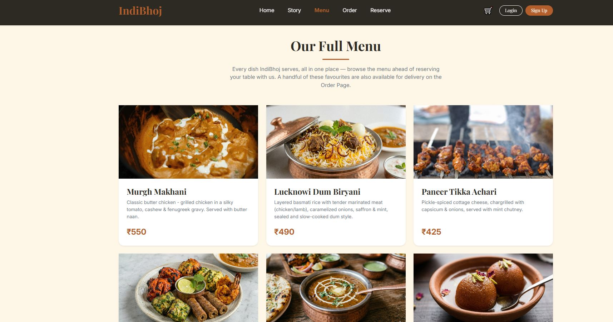
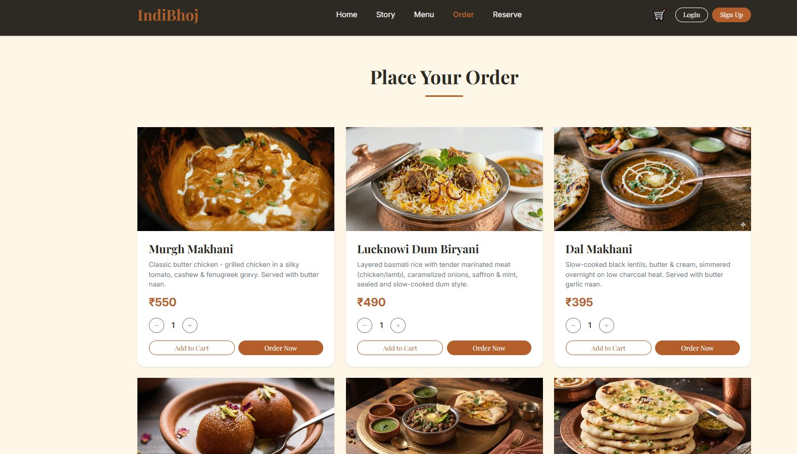

# IndiBhoj 🍽️

A restaurant website built with React — browse the menu, place orders, book a table, and manage your account.

---

## Screenshots

| Home | Story |
|---|---|
| |  |

| Menu | Order |
|---|---|
|  |  |

---

## Features

- Browse a full menu with categories (Starters, Main Course, Bread, Dessert)
- Add items to cart and place orders
- Book table reservations
- User signup / login
- Save a delivery address to your account
- Protected pages (Cart, Address) that require login

---

## Tech Stack

- **Frontend:** React 19 + Vite
- **Routing:** React Router v6
- **Styling:** Bootstrap 5
- **Mock backend:** [json-server](https://github.com/typicode/json-server) (serves `db.json` as a REST API)

---

## Getting Started

### 1. Install dependencies
```
npm install
```

### 2. Start the mock backend (in one terminal)
```
npm run server
```
This runs json-server, using `db.json` as the database.

### 3. Start the frontend (in another terminal)
```
npm run dev
```
This runs the Vite dev server.

You need **both** running at the same time for the app to work.

---

## Project Structure

```
src/
├── components/     # Reusable UI pieces (Navbar, Footer, MenuCard, etc.)
├── context/        # Global state (AuthContext, CartContext)
├── pages/          # Each route's page (HomePage, MenuPage, LoginPage, etc.)
├── Services/       # Functions that talk to the json-server API
db.json             # Mock database (users, menu, orders, reservations)
```

---

## Scripts

| Command | What it does |
|---|---|
| `npm run dev` | Start the frontend dev server |
| `npm run server` | Start the mock backend (json-server) |
| `npm run build` | Build the frontend for production |
| `npm run preview` | Preview the production build locally |
| `npm run lint` | Run ESLint |